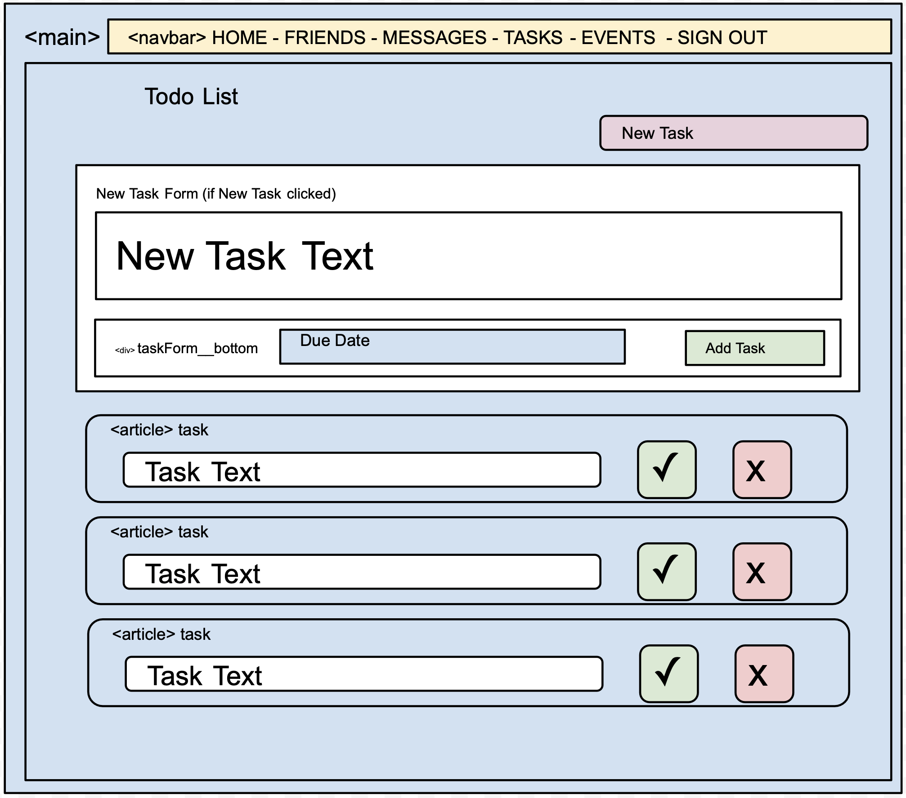

# Reactive Nutshell: The Information Dashboard

## Motive

1. Build a react app from scratch
1. Work as a team using react
1. Continuing utilizing github workflow

## What is Reactive Nutshell?

Nutshell is a new product offering that you have been tasked with building. It's an app for people to use to organize their daily tasks, events, news article, friends, and chat messages.


### Installation

Make a copy of Settings.js.example and remove .example 

Get an api key from https://openweathermap.org/ and add it to Settings .js 

Run a json-server from the api 
```
npm install

npm start 
```

### Features
- Mock login/registration 
- Public chat
- Add friends
- Post articles
- Post events
- Add tasks
- All user features are CRUD ready
- Articles and events are visible only to the creator and users who are "friends" with the creator
- Tasks are only visible to the creator
- Weather is available for events that are within the next 5 days
- Live chat can be demoed by logging in as seperate users in two browser windows
- Styling to indicate user vs friend content

### ERD

### Wireframe




### Support
Fill out a support ticket if you discover any major bugs to address. 

If you are memeber of the NSS Slack channel, feel free to sent a message on #pendand-of-intellect to contact us.

### Roadmap
Planned features include: 

- Private messaging
- 'Nevermind' functionality to editing messages. 
- More comprehensive styling
- User can set their location and view current weather
- Improved icons for weather data

### Contributing
Feel free to fork the repository and make pull requests. That said, we have no plans to maintain this project. 

### Authors & Acknowledgments
Special thanks to our team mentor [Scott Silver](https://github.com/Scott47) for his support and advice on this project. 

Links to our teammembers github pages: 

[Alex Martin](https://github.com/SubtleCo) 

[Dan Ross](https://github.com/Daniel-L-Ross) 

[Kaitlin Kelley](https://github.com/kjk1325) 

[Stacey Littrell](https://github.com/SLLittrell)

## A Note About Authentication

The login and registration code we use is fake, completely insecure, and would never be implemented in a professional application. It is a simulation authentication using very simplistic tools, because authentication is not a learning objective of students at NSS.

